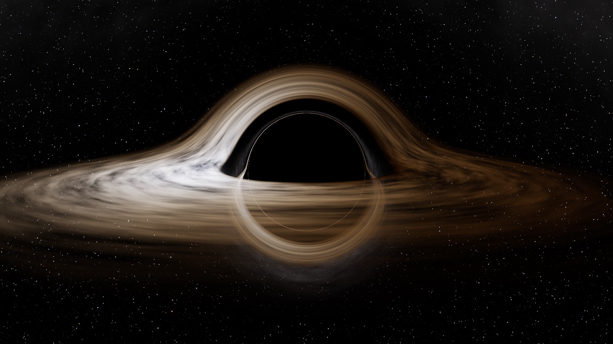
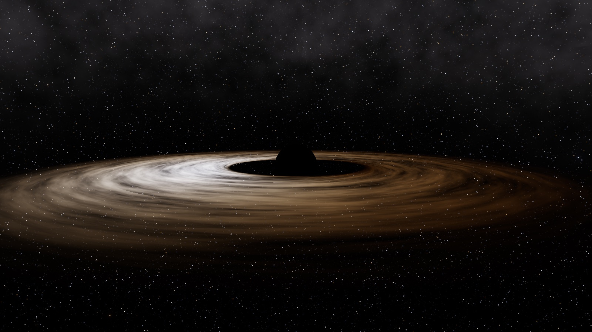
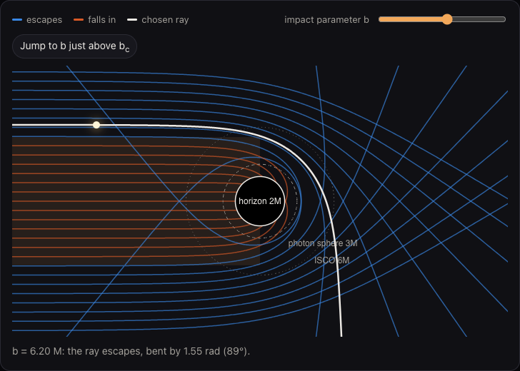
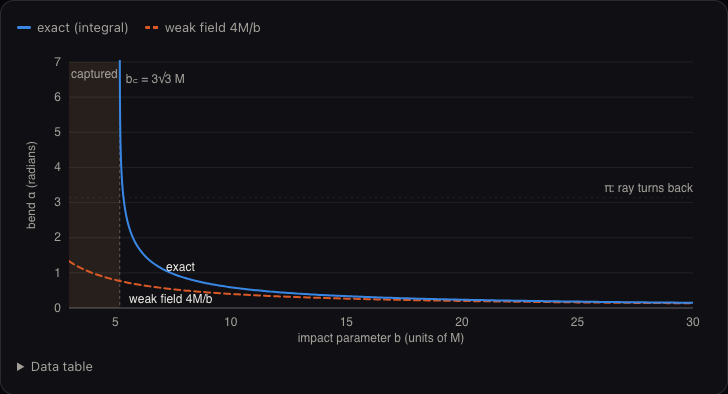
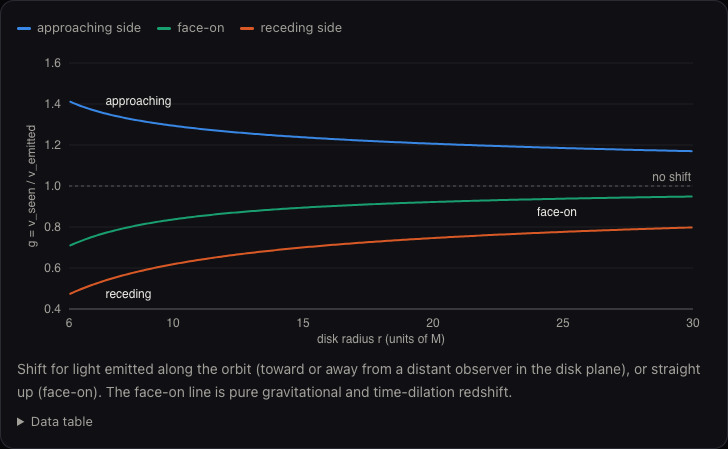
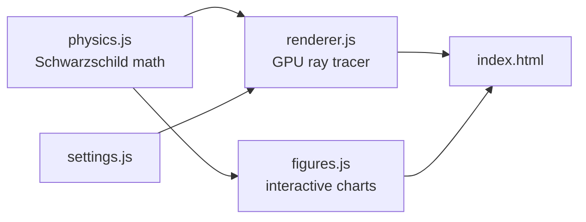

# Black Hole Simulator

A non-spinning black hole ray-traced live in your browser, with an illustrated walk-through of the math behind every pixel.

| Same view, light bending switched off | How rays bend near the hole |
|---|---|
|  |  |
| **Exact bend vs Einstein's 4M/b** | **Why one side of the disk is brighter** |
|  |  |

## Links

- [Instructions](docs/INSTRUCTIONS.md): set up, run, use
- [System design](docs/SYSTEM-DESIGN.md): how it works and why
- [File structure](docs/FILE-STRUCTURE.md): what's where
