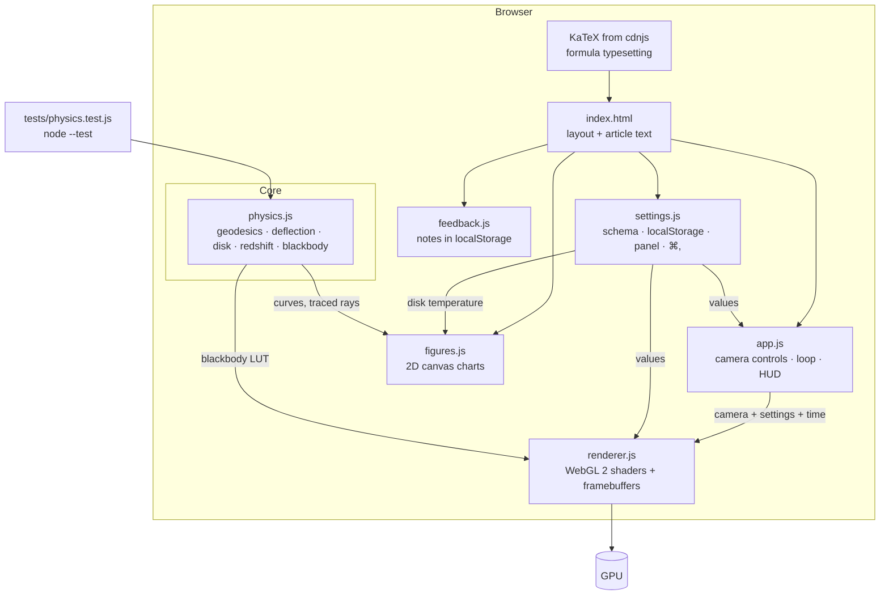

# System design

Black Hole Simulator is a static website. It has two parts: a live, GPU ray-traced view of a Schwarzschild (non-spinning) black hole with a thin accretion disk, and an article that explains the math, with interactive charts drawn from the same physics code.

## Architecture

## Components

| Component | Job |
|---|---|
| `js/physics.js` | All the physics, with no DOM access: constants ($r_h=2M$, $r_{ph}=3M$, $r_{isco}=6M$, $b_c=3\sqrt3M$), the Cartesian ray equation and an RK4 step, 2D ray tracing, the exact deflection integral, effective potential, Shakura–Sunyaev temperature profile, redshift factor $g$, and blackbody colour (Planck × CIE 1931 → linear sRGB). Loads as a browser global (`BH`) or a CommonJS module for the tests. |
| `js/renderer.js` | WebGL 2 renderer. The scene shader traces one ray per pixel and writes linear HDR (RGBA16F). Then come three bloom levels (bright pass + separable 9-tap Gaussian at ½, ¼, ⅛ size) and a composite pass (exposure, ACES, sRGB, vignette, dither). Also provides `orbitCamera()`. |
| `js/app.js` | Owns the live view: orbit camera state, pointer, pinch and wheel controls, the render loop (skipped while the view is off screen), the HUD, and the "Try it" buttons in the article. |
| `js/settings.js` | One schema lists every preference (label, range, default, help). It builds the Settings panel, saves values to localStorage, notifies listeners, and binds ⌘, / Ctrl+, and Esc. |
| `js/feedback.js` | Feedback tab. Saves notes to localStorage. Download as `.txt` or copy. Sends nothing. |
| `js/figures.js` | Five article figures on 2D canvases: effective potential, ray diagram (animated photon), deflection angle, disk redshift, and blackbody colour strip. Each has a hover tooltip. The line charts also have a data table. |
| `index.html` / `css/style.css` | Page structure, article text, panels. Dark only. Works down to phone width. |

## Main flows

**Rendering a frame** (`app.js` → `renderer.js`)

1. The `requestAnimationFrame` callback advances simulation time (scaled by *Disk spin speed*) and, if auto-orbit is on, the camera yaw.
2. The canvas is sized to CSS size × devicePixelRatio (capped at 2). The scene target is that × *Resolution*.
3. **Scene pass**, per pixel: build the ray direction from the camera basis and field of view. Compute $\mathbf h=\mathbf x\times\mathbf v$ (so $h^2$ sets the bending strength) and $L_z=-h_y$ (the photon's angular momentum about the disk axis, used for Doppler shift). Then loop up to *Max ray steps*:
   - stop if $r<2$ (horizon, black)
   - stop if $r$ is beyond the escape radius and moving outward (sky)
   - take one RK4 step of $\ddot{\mathbf x}=-3h^2\mathbf x/r^5$ with $dt = k\,r\,\mathrm{clamp}((r-2)/2,\,0.08,\,1)$
   - if the step crosses $y=0$ inside the disk, interpolate the hit, shade it, and composite front to back (the disk is partly transparent)
4. Escaped rays sample the sky. Stars are drawn in **pixel space**: the screen-space derivatives of the escape direction give the pixel's footprint on the sky, so each star stays about 1 px wide and its flux is multiplied by the lensing magnification.
5. Bloom, then composite to the screen.

**Shading the disk**: $T_n(r)$ from the thin-disk profile (normalised to peak 1). Then $g=\sqrt{1-3/r}\,/\,(1-\Omega L_z)\,/\,\sqrt{1-2/r_{cam}}$ with $\Omega=r^{-3/2}$. Observed colour is blackbody($gT_{peak}T_n$) from a 256-entry LUT. Brightness is $\propto(gT_n)^4$. Opacity and texture come from fBm noise in co-rotating coordinates.

**Changing a setting**: a panel input or a "Try it" button calls `Settings.set` → the value is saved to localStorage → listeners are notified (the blackbody figure redraws) → the next frame reads the new value. There's nothing to recompile: every option is a shader uniform.

**Article figures**: built once at load from `physics.js`. They redraw on resize and hover. The ray diagram animates only while on screen.

## Where data lives

| Data | Where |
|---|---|
| Settings | `localStorage["blackHoleSimulator.settings.v1"]`, per browser |
| Feedback notes | `localStorage["blackHoleSimulator.feedback.v1"]`, per browser, until downloaded |
| Camera position | In memory only (resets on reload) |
| Blackbody LUT | Computed at start-up, uploaded to a GPU texture |

There is no server, no account and no network traffic apart from loading KaTeX from cdnjs.

## Key decisions and trade-offs

| Decision | Why | Cost |
|---|---|---|
| **Website only, no Mac app** | The brief's deliverable is a website. The user confirmed. | No native packaging |
| **Exact Schwarzschild, no Kerr** | The math is exact and fits on one page. The user confirmed. | No spin, frame dragging or shadow asymmetry |
| **"Newtonian-equivalent" Cartesian ray equation** | Gives exactly the Schwarzschild orbit shape with simple vector math and no coordinate singularities at the poles. Fast on a GPU. | The parameter along the ray is not the affine parameter. Fine for images, but it can't give travel time. |
| **Fixed-ratio step + RK4 instead of adaptive error control** | Predictable cost per pixel. No divergent control flow. | Rays very close to the photon sphere can run out of steps (shown black). *Max ray steps* and *Step size* let the user trade speed for accuracy. |
| **Thin disk crossing via sign change of $y$** | Cheap and exact for a disk with zero thickness | No volumetric disk, jets or corona |
| **Blackbody LUT computed in JS** | One source of truth (`physics.js`), testable in Node | 256 log-spaced samples; colours between them are interpolated |
| **Stars in pixel space using derivatives** | Lensing near the Einstein ring (≈21° wide at r = 30M) stretches finite-size stars into streaks. Point stars should stay points. | Stars at the very edge of a 2×2 pixel quad can look slightly blocky |
| **Bloom + ACES** | The disk's dynamic range is huge. It reads naturally on screen. | Artistic, not physical. Adjustable in Settings. |
| **Classic scripts, no bundler** | Runs from `file://` with zero setup | Globals rather than modules |
| **Dark theme only** | It's a page about a black hole. The charts' palette was validated against the dark surface. | No light mode |
| **Feedback stays local** | No backend and no third-party service | Feedback reaches the author only if the reader downloads or copies it |

## How it's tested

- **Unit tests** (`node --test`, 10 tests) on `physics.js`:
  - key radii
  - the peak of $V(r)$ at $r=3M$ with value $1/27$
  - capture below and escape above $b_c$
  - multiple windings just above $b_c$
  - the exact integral against the second-order weak-field series at large $b$
  - the traced RK4 ray against the exact integral at $b=7,10,20$
  - conservation of $|\mathbf h|$
  - the redshift factor ($g=1/\sqrt2$ face-on at the ISCO; approaching > receding)
  - the temperature profile and its peak at $r=\tfrac{49}{36}r_{in}$
  - blackbody colours (2000 K red, 6500 K near white, 30000 K blue)
- **The shader** uses the same equation as `rayAccel` in `physics.js`. It was checked by rendering in headless Chrome (Metal) and Safari and comparing against known features:
  - the shadow edge at $b_c$
  - the lifted far side of the disk
  - the thin photon ring
  - the bright approaching side
  - a flat disk and a small sphere with lensing off
  - a symmetric disk with Doppler off
- **Interaction**, checked through the DevTools protocol:
  - feedback save
  - ⌘, and Esc
  - settings persist across reload
  - KaTeX renders
  - "Try it" buttons
  - no horizontal scroll at 390 px wide

## Known limits

- No spin (Kerr), charge, or time-dependent spacetime.
- The camera is a static observer. Pixel directions are treated as flat, without the aberration a real hovering observer would see. The camera's own gravitational blueshift is included in $g$.
- The disk has zero thickness. Its brightness is bolometric ($g^4$), and its colour is a blackbody at the shifted temperature $gT$. No limb darkening, no radiative transfer, and no light returning to the disk.
- Rays that run out of steps are drawn black. Rays still bending at the escape radius are treated as already at infinity.
- Stars and the galactic band are procedural, not a real catalogue.
- Needs WebGL 2 with `EXT_color_buffer_float`. Otherwise the live view shows a message and the article still works.
- Performance depends on the GPU. Lower *Resolution* on slow machines.
